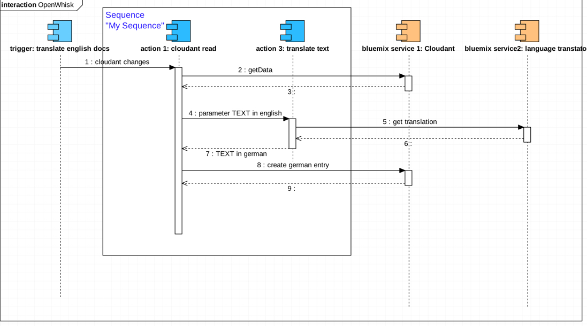
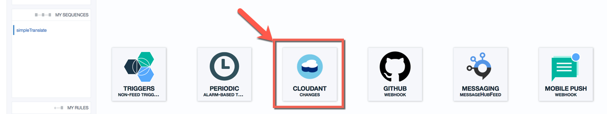

# OpenWhisk/Functions Hands-on Workshop

**German version**

Dies ist ein einfacher einstündiger Workshop für **OpenWhisk/Functions** auf Bluemix.

[Apache OpenWhisk](https://openwhisk.incubator.apache.org/)
_Apache OpenWhisk (Incubating) is a serverless, open source cloud platform that executes functions in response to events at any scale._

Für die Durchführung wird ein Bluemix Account für die Region **US-South** benötigt (oder einer anderen Region in der Bluemix OpenWhisk/Functions läuft).

Eine kurze Zusammenfassung der wichtigsten Schritte sind in dem [PDF](OpenwhiskHandson_PoT.pdf) und in der readme.md hinterlegt. Die wichtigsten Code-Schnipsel für die einzelnen Schritte befinden sich in Text-Dateien.

## Ein erster Überblick auf die Zusammenhänge

Hier ein Überblick auf die Zusammenhänge von **Trigger**, **Sequences** und **Actions**, im Zusammenhang mit den, in diesem Lab, verwendeten Bluemix Services.


Das Sequence Diagram soll den Ablauf verdeutlichen, wie in OpenWhisk/Functions die **Trigger**, **Sequences**, **Actions** und **Bluemix Service** in dem Hands-on Beispiel aufgerufen werden.



---
## Kurzanleitung <a name="part0"></a>

1. [Erstellen der Bluemix Services](#part1)
2. [OpenWhisk/IBM Functions als Compute Modell](#part2)
3. [OpenWhisk/IBM Functions Working with Actions](#part3)
4. [OpenWhisk/IBM Functions Working with Sequences](#part4)
5. [OpenWhisk/IBM Functions Working with Rules](#part5)
6. [OpenWhisk/IBM Functions Working with extend Sequence](#part6)
7. [OpenWhisk/IBM Functions Working with Trigger and Rules](#part7)
8. [Testing the OpenWhisk usage](#part8)

---
[zurueck zur Kurzanleitung](#part0)
### 1. **Erstellen der Bluemix Services** <a name="part1"></a>

1. Im Browser die Bluemix Console in den USA öffnen https://console.ng.bluemix.net/ und mit den eigenen Zugangsdaten anmelden.

2. Für den späteren Verlauf der Übungen benötigen wir zwei Services, die wir an dieser Stelle
schon einmal anlegen wollen. Dazu bitte den “Katalog” anwählen.

---
[zurueck zur Kurzanleitung](#part0)
#### 1.1 **Cloudant Services**

 1. In der Suchzeile des Kataloges **Cloudant** eingeben, den Service auswählen
 2. Auf der Detail-Seite des Services alle Voreinstellungen so belassen und auf **Create** klicken
 3. Nachdem der Datenbank-Service erfolgreich erstellt wurde, erscheint im Browser eine Seite mit den **Details zum Service**.
 4. Hier gibt es noch zwei Dinge zu tun. Zum einen müssen über den Link **Service Credentials** die
Parameter erstellt werden mit dem der Cloudant Service in OpenWhisk verwendet werden kann.
Dazu bitte auf der Credentials Seite des DB Service einmal auf „New Credential“ klicken.


  * Auf der Seite **Manage**, bitte auf den **Launch**-Button auf der rechten Seite klicken und das
Management Dashboard von Cloudant in einem separaten Tab öffnen.
  * Im Cloudant Management Dashboard mit **Create database** eine Datenbank mit dem Namen
**openwhisktest** erstellen.
Wenn die Datenbank erfolgreich erstellt ist, wieder in den Bluemix-Browser-Tab und danach mit
dem **Katalog** Link zurück zum Katalog wechseln.

---
[zurueck zur Kurzanleitung](#part0)
#### 1.2 **Watson Language Translator Services**

1. In der Katalog-Ansicht **Translator** in die Suchzeile eingeben, um den **Watson Language Translator** zu finden.
2. Den Service anwählen, in der Service-Seite alle Voreinstellungen so belassen und auf
“Create” klicken. Wenn der Service erfolgreich erstellt worden ist, wieder mit dem Link **Katalog**
auf die Katalog-Seite wechseln.

Das Ergebins im Dashboard.


---
### 2. **OpenWhisk (IBM Functions) als Compute Modell** <a name="part2"></a>

1. Auf der linken Seite im Katalog **Openwhisk (Functions)** als Compute Modell auswählen.

2. Die Detail-Seite mit dem Openwhisk Service öffnet sich. Diesen anklicken.
3. Auf Seitenleiste Bluemix **OpenWhisk/Functions** den Link **Develop** auswählen.
4. Der **Openwhisk Browser Editor** öffnet sich und sollte direkt den **Develop** Tab öffnen.


---
[zurueck zur Kurzanleitung](#part0)
### 3. **OpenWhisk (IBM Functions) Working with Actions** <a name="part3"></a>

1. Auf dem **Develop** Tab sieht man auf der linken Seite die Übersicht der **Actions**, die
schon definiert sind, es sollten genau zwei sein: **"Hello World”**  und **“Hello World With
Params”**. Ebenso ist die Liste der **“Sequences”** und die Liste der **“Rules”** zu sehen.
2. Von der Liste der vordefinierten Actions **“Hello World With Params”** auswählen, sodass im
rechten oberen Editor-Fenster der hinterlegte Code erscheint.
3. Für **Actions** steht eine einzelne Variable für den Input zur Verfügung, die in dem Code Beispiele mit **params** deklariert wird. Input Werte können mit einem **JSON Dokument** als **Key:Value** Paare übergeben werden.
```
    /**
     *
     * main() will be invoked when you Run This Action.
     *
     * @param OpenWhisk actions accept a single parameter,
     * which must be a JSON object.
     *
     * In this case, the params variable will look like:
     * { "message": "xxxx" }
     *
     * @return which must be a JSON object.
     * It will be the output of this action.
     *
     */
     function main(params) {
       return { "message": "you sent me " + params.message };
     }
```

4. Das Code Beispiel soll nun wie folgt abgeändert werden, um aus dem übergebenen Input
den Namen und den Ort auszulesen. Bitte die **return**-Zeile komplett durch folgenden Teil
ersetzen:
```
    return { message: 'Hello, '+ params.name + ' from ' + params.place + '. It is a great pleasure to have you here.'};
```

5. Die Funktion erwartet ein **JSON document** mit den Schlüsseln **“name”** und **“place”**. Um die **Action** zu testen, geht man nun auf den **“Make it live”** Button rechts unten und speichert den veränderten Code im eigenen Arbeitsbereich. Anschliessend oben links auf den Button **“Run this Action”** klicken, um die **Action** zu testen.


6. Auf der folgenden Seite muss das **JSON Document** für den Test eingegeben werden. In dem
erscheinenden Editor **(“JSON Input”)** das angezeigte **JSON** durch folgendes ersetzen oder oder eigene Werte für **name** und **place** vergeben.
```
    {
     "name": "Alien",
     "place": "New York"
    }
```


7. Die Eingabe mit dem Button **“Run with this value”** in der rechten unteren Ecke bestätigen.
8. Als Ergebnis sollte ein neues Fenster mit dem Consolen Log erscheinen, der ebenfalls
wiederum ein **JSON Format** mit dem **Schlüssel** **“message”** und dem zusammengebauten
Text ausgibt. In dem Konsolenlog sieht man auch, dass diese **Action** für insgesamt nur **751ms** berechnet wird. z.B.:


9. Von der Console kommt man wieder zurück zum Editor durch Drücken des Knopfes
**“Close”** unten rechts.

---
[zurueck zur Kurzanleitung](#part0)
### 4. **OpenWhisk (IBM Functions) Working with Sequences** <a name="part4"></a>

Aktionen können verknüpft werden zu Ketten, sogenannten **“sequences”**. Dabei stehen die **JSON-Objekte** die eine Aktion zurückgibt, gleichzeitig als Input-Werte für die Folgeaktion zur Verfügung. Neben selbstgeschriebenen Funktionen stellt OpenWhisk auch eine Vielzahl von vorgefertigten **Actions** zur Verfügung, die direkt mit den **Bluemix Services** arbeiten. Ein Beispiel dafür ist der **Watson Language Service**, mit dem wir im folgenden einen kleinen Text übersetzen wollen.

1. Erstellen Sie bitte eine neue **Action** mit dem Namen **“translateText”**. Dazu wählen Sie im Editor **“Create Action”**. Geben Sie den Namen ein und lassen Sie die voreingestellten Werte, wie sie sind.

2. Im Editor erscheint ein einfaches Gerüst Ihrer Function:
```
    function main(params) {
      return { message: 'Hello World' };
    }
```

3. Ersetzen Sie die Zeile, die mit **“return ..”** beginnt, durch die folgende Zeile:
```
    return ({ "translateTo": "de", "payload" : "Hello this is the message"});
```

4. So wird ein **JSON Dokument** direkt in dem Format ausgegeben, das wir für den nächsten Schritt, den **Watson Language Translator**, benötigen. Der Text, der zum Schlüssel **“payload”** gehört, wird in diesem Beispiel ins Deutsche übersetzt. Wenn Sie möchten, können sie auch ins Französische, **“fr”**, oder Spanische, **“es”** übersetzen lassen.

5. Wenn Sie die **return** Zeile angepasst haben, dann speichern Sie die Änderung mit dem **“Make it live”** Button unten rechts ab.

6. Im nächsten Schritt wird eine **sequence** erstellt. In der eben im Editor erstellten **Action** drücken Sie bitte den Button **“Link into a Sequence”** unten rechts. Im Folgenden können Sie aus den vorgefertigten Packages auswählen, um eine neue Sequence zu erstellen, wählen Sie das Package **“Watson Translator”** aus.


7. Im folgenden Package Browser wählen Sie bitte die **Action** **“translator”** aus, damit wir einen übergebenen Text auch wirklich übersetzen können.

8. Nun müssen Sie die Action noch mit dem **Watson Translator Service** verbinden, ein sogenanntes
**“Binding”** auswählen oder ggf. erstellen. Wenn Sie zu Beginn den Language Translator Service
erstellt haben sollte dieser Service Ihnen als Binding vorgeschlagen werden. Wählen Sie die graue, sechseckige **"Watson-Translator“** Kachel aus, so daß diese hellblau eingefärbt ist.


9. Um den Schritt abzuschliessen, ist es nun wichtig, das im Package Browser sowohl **“translator”** als auch das Binding “TranslationService” ausgewählt, sprich blau hinterlegt sind. Diesen Schritt abschliessen durch drücken des Buttons **“Add to Sequence”**.


10. Im abschliessenden Schritt wird die **Sequenz** noch einmal dargestellt. Sie sollte aus zwei Schritten bestehen, die selbst erstellte Action zuerst und anschliessend die **Watson Tanslator Action**. Falls die Reihenfolge nicht stimmt, kann man die Action mit den Pfeil- Buttons nach oben oder unten verschieben. Um zum Speichern zu gelangen den Button **“This looks good”** rechts unten klicken und der sequence noch einen eindeutigen Namen geben, z.B. **“simpleTranslate”** und den Wizard mit Drücken auf den Button **“Save Action sequence”** rechts unten abschliessen.

11. Die **Sequence** erscheint im Bereich **“My Sequences”** auf der linken Seite. Wenn sie ausgewählt ist, kann sie mit **“Run this Sequence”** getestet werden.


12. Auch wenn der Input-Editor ein **JSON Dokument** erwartet, so ist das für unseren erstenTest nicht entscheidend, da wir hier nur eine im Code fest geschriebene Nachrichtübersetzen. Deshalb direkt mit **“Invoke ...”** ausführen und Sie sollten die Übersetzung der Originalnachricht in der gewünschten Sprache sehen.

---
[zurueck zur Kurzanleitung](#part0)
### 5. **OpenWhisk (IBM Functions) Working with Rules** <a name="part5"></a>

Die Idee hinter Serverless Programming ist, dass die **Actions** oder **Sequences** durch **Trigger** ausgelöst werden, dies kann, wie in unserem folgenden Beispiel, das Schreiben in eine Datenbank sein. Das heisst im Folgenden erstellen wir eine **Rule**: _Immer wenn_ **ein Document in einer Cloudant Datenbank erstellt oder verändert** _wird, startet die Regel die Action Sequence_, die folgende Schritte umfasst:

1. **Cloudant Read Document** – Action aus dem Cloudant Package das das Dokument mit
der übergebenen ID liest und an das Dokument als JSON an die nächste Aktion liefert

2. **translateText** – Action aus dem vorherigen Schritt, so modifiziert, dass der richtige
Schlüssel an den Watson Translator übergebne wird.

3.  **Watson Translator** – Übersetzung des übergebenen Textes.


---
[zurueck zur Kurzanleitung](#part0)
### 6. **OpenWhisk (IBM Functions) Working with extend Sequence** <a name="part6"></a>

Der **Trigger** den wir später einführen liefert uns als Ergebnis die **docID** des veränderten Dokumentes in der **Cloudant-Datenbank**. Deshalb müssen wir erstellte Sequence nur noch mit der **Aktion** für das Lesen des Dokumentes _erweitern_. Dies geschieht mit einem **vorgefertigten Action aus dem Cloudant Package**.

1. In der Liste **“My Sequences”** die eben erstellte Sequence **“simpleTranslate”** auswählen und im Editor unten rechts den **“Extend”** Button drücken.

2. Der **“Action Sequence Viewer”** wird geöffnet und aus der Auswahl drücken Sie bitte auf die **“Cloudant”** Schaltfläche um den Package Browser des Cloudant Packages zu öffnen.

3. Im Package Browser stehen Ihnen dann verschiedene vorgefertigte **Actions** zur
Verfügung. Wählen Sie dort bitte die Action **“Read document”** an.


4. Wie schon beim **Watson Translator** muss hier ein **“Binding”** erstellt werden. Dazu bitte unten links auf **"New Binding”** klicken.

5. Im **“New Package Binding”** Dialog geben Sie dem Binding einen Namen, z.B. **“CloudantDocRead”**. Wenn Sie zu Beginn den Cloudant DB Service mit entsprechenden **Service Credentials** erstellt haben, dann sehen Sie in diesem Dialog eine Auswahlliste, in dem Sie ihre Cloudant DB auswählen können.

6. Wenn Sie diese ausgewählt haben, so erscheint eine zweite Auswahlliste in der Ihre eben erstellte DB angezeigt werden sollte. Wenn die Einstellungen passen, dann bitte mit **"Save Configuration“** speichern.

7. Im Package Browser darauf achten das **“Read document”** und das neu erstellte Binding
hellblau hinterlegt sind, erst dann auf **“Add to sequence”** klicken. Damit wird diese
Action an das Ende eingefügt.


8. Die soeben angehängte Action muss nun in der Sequence an den **Anfang der Sequenz** geschoben werden, dazu die Action mit dem Pfeil Button **nach oben verschieben**.

9. Am Ende sollte die Sequence wie folgt aussehen:

* CloudantDocRead
* translateText
* TranslationService


Im Openwhisk Editor auf der linken Seite aus der Liste **“My Actions”** die Action **“translateText”** aufrufen, sodass der Code im Editor sichtbar ist. Im anschliessenden Test werden wir in der **Cloudant-Datenbank** ein Dokument erstellen und dort einen Schlüssel **“english”** verwenden. Damit dieser Schlüssel richtig erkannt wird, bitte die **return-Zeile** durch folgenden Code ersetzen:

```
    // return ({ "translateTo": "de", "payload" : "Hello this is the message"}); old code
    return ({ "translateTo": "de", "payload" : params.english}); // new code
```

Also insgesamt sollte dort stehen:

```
    function main (params) {
       return ({ "translateTo": "de",
                 "payload"    : params.english});
    }
```
Wenn Sie fertig sind mit dem editieren der Aktion, abspeichern mit **“Make it live”** nicht vergessen!

---
[zurueck zur Kurzanleitung](#part0)
### 7. **OpenWhisk (IBM Functions) Working with Trigger and Rules** <a name="part7"></a>

Jetzt wo die **"Sequence"** fertig ist fehlt nur noch der Auslöser, der **"Trigger"**.

1. Dazu aus der Liste **“My Sequences”** die eben erstellte Sequence auswählen und unten rechts auf **“Automate”** klicken. Im folgenden Dialog die **“Cloudant Changes”** Schaltfläche anwählen, zum Konfigurieren auf welche Datenbankänderung reagiert werden soll.


2. Wählen Sie **“New Trigger”** durch klicken auf das grüne Sechseck. Im folgenden können Sie dem Trigger einen Namen geben, z.B. “translateEnglishDocs” und wählen aus der Dropdown-Liste die von Ihnen im Schritt 2 erstellte Datenbank. Wiederum wird automatisch im zweiten Dropdown die ebenfalls von Ihnen erstellte Datenbank eingestellt, sodass sich ein ähnliches Bild wie das folgende ergibt und es müssen nur Datenbank Instanz und Name ausgefüllt sein, alle anderen Einstellungen können leer bleiben. Wenn alle Einstellungen korrekt sind, bitte mit **“Save configuration”** abspeichern.


3. Das neue Binding wird als blau hinterlegtes Sechseck dargestellt. Klicken Sie auf Next.


4. Im nächsten Schritt sehen Sie wie dieser **Trigger** an den Anfang Ihrer **Sequence** gestellt wird, so daß daraus nun eine **Rule** geworden ist: _“Wenn ein Dokument in der Datenbank geändert wird, dann starte die erste Action der Sequence.”_


5. Wenn Sie mit der **"Rule"** zufrieden sind, so gelangen Sie mit dem Button **“This looks good”** zum abschließenden Schritt, in dem Sie der Rule noch einen Namen geben können, bevor Sie den wizard mit **“Save rule”** abschliessen.

5. Mit dem Abspeichern der Rule ist diese auch gleichzeitig scharf geschaltet worden! Von diesem Moment an führt jede Veränderung eines Dokumentes in der Datenbank zum Auslösen des Triggers und zum Ausführen der Sequence.


---
[zurueck zur Kurzanleitung](#part0)
### 8. **Testing the OpenWhisk (IBM Functions) usage** <a name="part8"></a>

1. **Zum Testen** wechseln Sie bitte zuerst von **“Develop”** Ansicht im OpenWhisk Editor auf die
**“Monitor”**-Ansicht.

2. Anschliessend wechseln Sie bitte zum **Cloudant-Dashboard**, das Sie von einem anderen Schritt  in einem anderen Browser Tab noch geöffnet haben sollten. Falls dies nicht der Fall ist, dann öffnen Sie bitte in einem neuen Browser Tab das Bluemix Dashboard, wählen Ihren Cloudant
Service an und öffnen von dort über den **“Launch”**-Button das **Cloudant Dashboard**


3. Wählen Sie die von Ihnen erstellte Datenbank aus. Nun können Sie in der Datenbank ein neues
Dokument erstellen. Dazu klicken Sie bitte auf das +-Zeichen neben **“All Documents”** und
anschliessend auf **“New Doc”**:


4. Im Editor wird ein **JSON-Dokument** mit einem **_id** Schlüssel erstellt. Fügen Sie hinter diesem Schlüssel noch den “english”-Schlüssel ein mit einem englischen Text, wie z.B.
```
{
    "_id" : "01_FIRST_ENTRY",
    "english" : "I have a dream that my four little children will one day live in a nation where they will not be judged by the color of their skin but by the content of their character."
}
```
Mit dem Klick auf **“Create Document”** wird das neue Dokument in der Datenbank gespeichert und sollte für das **Auslösen des Triggers sorgen**.


5. Wechseln Sie zurück zu dem Browser Tab in dem der OpenWhisk Monitor zu sehen ist.
Dort können sie in dem **“Activity Log”** oben rechts die Ausführung der Sequence verfolgen.
Am Ende sollten Sie im Log die Ausgabe des übersetzten Textes sehen.

